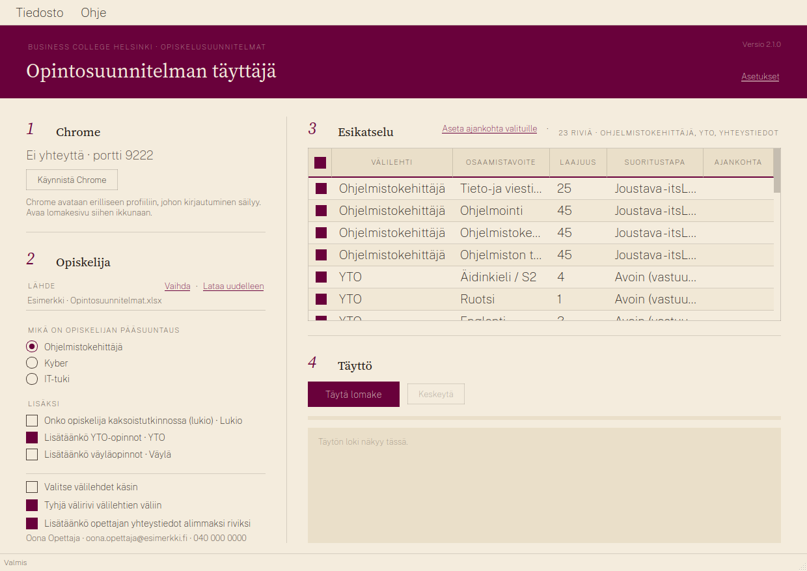
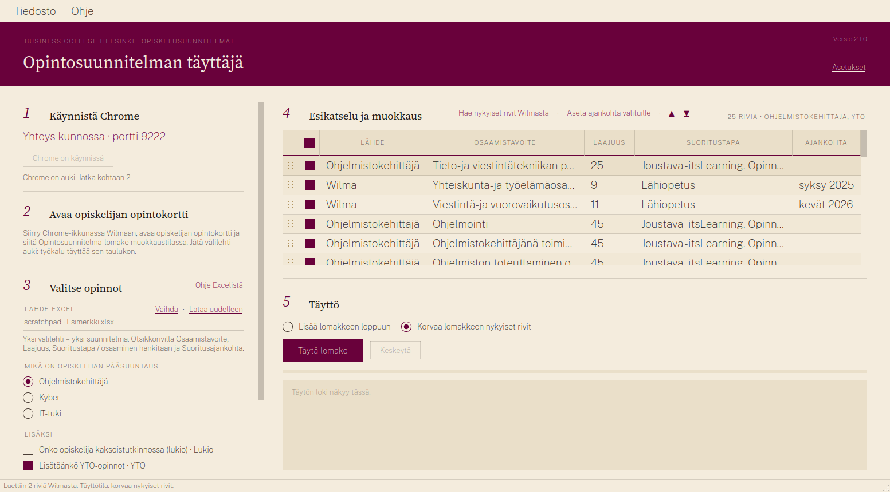
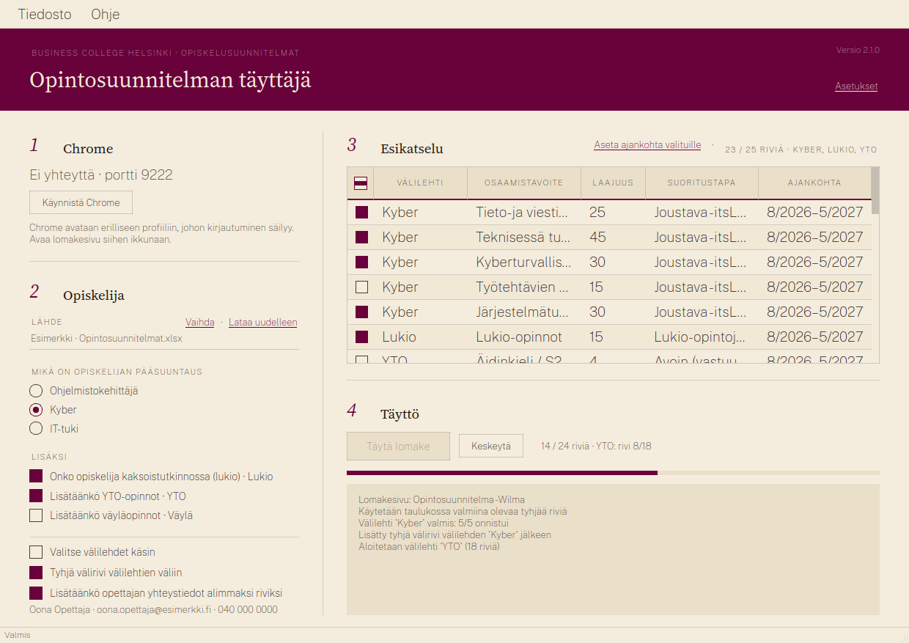
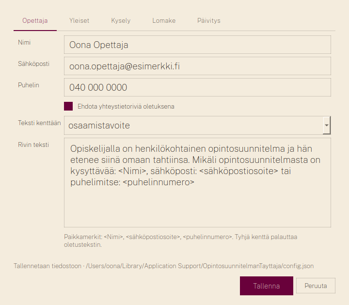
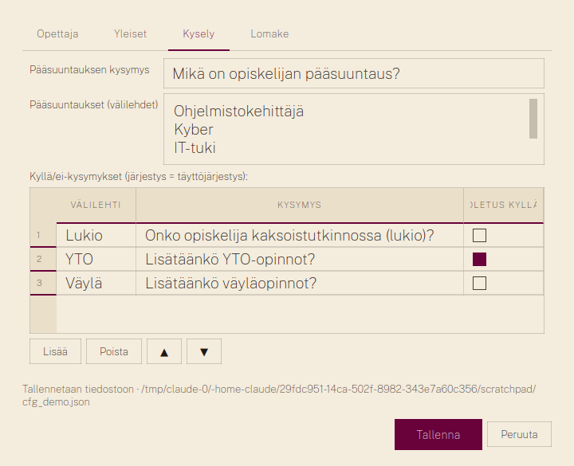

# Opintosuunnitelman muokkaaja

(Repo ja Python-paketti: `Opiskelusuunnitelmoittaja` / `opiskelusuunnitelmoittaja`; komentorivikomento `suunnitelmoittaja`.)

Täyttää opiskelusuunnitelmalomakkeen selaimessa Excel-taulukosta rivi kerrallaan, jotta samaa
taulukkoa ei tarvitse naputella käsin joka opiskelijalle. Työkalu kytkeytyy sinun omaan, jo
kirjautuneeseen Chromeesi (Playwright + Chrome DevTools Protocol), joten kirjautumisia tai
salasanoja ei tarvitse antaa skriptille.

Versio 2 on kirjoitettu uusiksi: Selenium ja webdriver-manager on korvattu Playwrightilla,
pandas openpyxl:llä, ja projekti käyttää `pyproject.toml`-määrittelyä ja `uv`-työkalua.
Toimii macOS:llä, Windowsilla ja Linuxilla. Versiossa 2.1 on graafinen käyttöliittymä ja
valmiit sovelluspaketit.

**Käyttäjälle:** valmis sovellus ladataan [Releases-sivulta](https://github.com/mattiseise/Opiskelusuunnitelmoittaja/releases/latest),
ei tästä lähdekoodista – ks. [Asennus](#asennus).



*Kuvien data on keksittyä esimerkkidataa.*

## Asennus

> **Lataa valmis sovellus GitHubin Releases-sivulta:**
> **<https://github.com/mattiseise/Opiskelusuunnitelmoittaja/releases/latest>**
>
> Tätä repon etusivua tai vihreää *Code*-nappia ei tarvita: ne ovat lähdekoodia kehittäjille.
> Releases-sivulla uusin versio on ylimpänä, ja asennettavat tiedostot ovat sen kohdassa
> **Assets** (avaa se, jos lista on supistettuna). Valitse oman koneesi tiedosto:
>
> | Kone | Ladattava tiedosto |
> |---|---|
> | Mac (Apple Silicon, M1–M4) | `OpintosuunnitelmanTayttaja-<versio>-macos-arm64.dmg` |
> | Windows 10/11 | `OpintosuunnitelmanTayttaja-<versio>-windows-x64.zip` |
>
> `.sha256`-tiedostot ja *Source code* -paketit voi jättää huomiotta.

Sovellus tarvitsee koneelta Google Chromen. Kaikki muu (Python, Playwright-ajuri, fontit)
tulee paketin mukana. Asennus ei vaadi järjestelmänvalvojan oikeuksia.

### macOS

1. Avaa ladattu `.dmg` ja vedä *Opintosuunnitelman muokkaaja* Ohjelmat-kansioon.
2. Ensimmäisellä avauksella macOS estää sovelluksen, koska paketti on allekirjoitettu ad hoc
   eikä Applen notarisoima. Salli se: **Järjestelmäasetukset → Tietosuoja ja suojaus**, rullaa
   alas kohtaan *"Opintosuunnitelman muokkaaja" estettiin* ja paina **Avaa silti**. Vaihtoehto
   Terminaalissa:

   ```bash
   xattr -dr com.apple.quarantine "/Applications/Opintosuunnitelman muokkaaja.app"
   ```

3. Käynnistä sovellus Launchpadista tai Spotlightista ("Opintosuunnitelman muokkaaja").

Asetukset ja Excel-pohja kopioidaan ensimmäisellä käynnistyksellä kansioon
`~/Library/Application Support/OpintosuunnitelmanTayttaja/` (Tiedosto → *Avaa asetuskansio*).

### Windows 11 (ja 10)

1. Pura ladattu `.zip` kansioon, joka jää pysyvästi paikalleen, esimerkiksi
   `C:\Ohjelmat\OpintosuunnitelmanTayttaja\` (hiiren oikea → *Pura kaikki…*). Älä käynnistä
   ohjelmaa suoraan zip-paketin sisältä.
2. Käynnistä `OpintosuunnitelmanTayttaja.exe`.
3. Pikakuvake: hiiren oikea exe-tiedostoon → *Näytä lisää vaihtoehtoja* → *Lähetä kohteeseen* →
   *Työpöytä (luo pikakuvake)*, tai kiinnitä käynnissä oleva sovellus tehtäväpalkkiin.

Asetukset ja Excel-pohja kopioidaan ensimmäisellä käynnistyksellä kansioon
`%APPDATA%\OpintosuunnitelmanTayttaja\` (Tiedosto → *Avaa asetuskansio*).

#### SmartScreen ja Defender Windows 11:ssä

Paketti ei ole koodiallekirjoitettu, joten Windows kohtelee sitä tuntemattomana ohjelmana. Se on
odotettua, ei merkki viruksesta. Tilanteet ja niiden ratkaisut, kevyimmästä alkaen:

**Selain varoittaa latauksesta** ("tätä tiedostoa ei ladata yleisesti" / "saattaa olla
vaarallinen"). Chrome: latauslistassa tiedoston kohdalla *⋮* tai nuoli → **Säilytä** (tai
*Säilytä silti*). Edge: latauslistassa *…* → **Säilytä** → *Näytä lisää* → **Säilytä silti**.

**Sininen "Windows suojasi tietokonettasi" -ikkuna käynnistettäessä.** Tämä on SmartScreen.
Paina ikkunassa **Lisätietoja** (pieni linkki tekstin alla), jolloin näkyviin tulee nappi
**Suorita silti**. Windows muistaa valinnan tälle tiedostolle; varoitus voi tulla uudelleen
seuraavan version jälkeen.

**"Suorita silti" ei näy tai ohjelma ei käynnisty.** Exe voi olla merkitty internetistä
ladatuksi. Hiiren oikea `OpintosuunnitelmanTayttaja.exe` → **Ominaisuudet** → välilehti
*Yleiset* → alareunassa *Suojaus: tämä tiedosto on peräisin toisesta tietokoneesta…* → rasti
**Poista esto** → *OK*. Sama voi koskea koko purettua kansiota: tee tämä alkuperäiselle
zip-tiedostolle ennen purkamista, niin merkintä ei periydy tiedostoihin.

**Defender ilmoittaa uhasta tai poistaa tiedoston.** Pakattu Python-sovellus laukaisee joskus
väärän hälytyksen (tyypillisesti `Trojan:Win32/Wacatac` tai `Program:Win32/...`). Palauta se:
**Windowsin suojaus** (Käynnistä → kirjoita *Windowsin suojaus*) → **Virusten ja uhkien
torjunta** → **Suojaushistoria** → avaa ilmoitus → *Toiminnot* → **Palauta** tai **Salli
laitteessa**. Jotta sama ei toistu päivityksissä, lisää asennuskansio poikkeuksiin: *Virusten ja
uhkien torjunta* → *Virusten ja uhkien torjunnan asetukset* → **Hallitse asetuksia** → rullaa
kohtaan **Poikkeukset** → *Lisää tai poista poikkeuksia* → **Lisää poikkeus → Kansio** → valitse
`C:\Ohjelmat\OpintosuunnitelmanTayttaja`. Poikkeuksen lisääminen vaatii järjestelmänvalvojan
oikeudet.

**SmartScreenin asetukset**, jos varoitukset halutaan pois kokonaan: *Windowsin suojaus* →
**Sovellusten ja selaimen hallinta** → *Maineeseen perustuva suojaus* → **Maineeseen perustuvan
suojauksen asetukset**. Kohta *Tarkista sovellukset ja tiedostot* on se, joka näyttää sinisen
varoitusikkunan. Suosittelemme jättämään sen päälle ja käyttämään yllä olevaa *Suorita silti*
-reittiä; kytkimen sammuttaminen poistaa suojan kaikilta ladatuilta ohjelmilta.

**Työpaikan hallinnoitu kone (Intune).** Jos *Suorita silti* -nappia ei ole lainkaan tai
Defenderin asetukset ovat harmaina, organisaation käytäntö estää tuntemattomat ohjelmat.
Tällöin pyydä IT:tä sallimaan `OpintosuunnitelmanTayttaja.exe` tai jakamaan paketti keskitetysti;
itse et voi ohittaa estoa.

## Kehittäjille

### macOS

**Kehitysversio lähdekoodista** (Homebrew ja uv):

```bash
brew install uv
git clone https://github.com/mattiseise/Opiskelusuunnitelmoittaja
cd Opiskelusuunnitelmoittaja
uv sync --extra gui
uv run suunnitelmoittaja-gui           # käyttöliittymä
scripts/make-launcher.sh --dock        # Dock-käynnistin "Opintosuunnitelman muokkaaja"
```

Myös kehitysversio käyttää käyttäjän asetuskansiota, joten opettajan yhteystiedot eivät päädy
repon `config.json`-tiedostoon; komentorivi (`uv run suunnitelmoittaja`) lukee edelleen repon
`config.json`-tiedostoa, tai annetun `-c`-tiedoston.

**Oma paketti** (.app + .dmg kansioon `dist/`):

```bash
scripts/build.sh
```

**Komentorivi** (samasta kansiosta):

```bash
uv run suunnitelmoittaja chrome        # käynnistä Chrome, avaa lomake siihen ikkunaan
uv run suunnitelmoittaja fill          # ohjattu kysely: pääsuuntaus, lukio, YTO, väylä
uv run suunnitelmoittaja fill 1,3      # tai välilehdet suoraan
uv run suunnitelmoittaja fill 2 --dry-run
```

Paketoidusta sovelluksesta komentorivi on
`"/Applications/Opintosuunnitelman muokkaaja.app/Contents/MacOS/OpintosuunnitelmanTayttaja" --cli fill 1`.

### Windows

**Kehitysversio lähdekoodista** (PowerShell; uv asennetaan wingetillä):

```powershell
winget install --id astral-sh.uv -e
git clone https://github.com/mattiseise/Opiskelusuunnitelmoittaja
cd Opiskelusuunnitelmoittaja
uv sync --extra gui
uv run suunnitelmoittaja-gui
```

**Oma paketti** (.zip kansioon `dist\`):

```powershell
powershell -ExecutionPolicy Bypass -File scripts\build.ps1
```

**Komentorivi**:

```powershell
uv run suunnitelmoittaja chrome
uv run suunnitelmoittaja fill
uv run suunnitelmoittaja fill 1,3
```

Paketoidusta sovelluksesta: `OpintosuunnitelmanTayttaja.exe --cli fill 1`.

### Julkaisu (molemmat paketit kerralla)

Versiotagi käynnistää GitHub Actions -putken, joka ajaa testit, rakentaa macOS- ja
Windows-paketit ja liittää ne Releaseen asennusohjeineen:

```bash
git tag v2.5.3
git push origin v2.5.3
```

## Käyttö ikkunassa

Ikkuna kulkee viidessä vaiheessa:

1. **Käynnistä Chrome.** Nappi avaa Chromen erilliseen profiiliin, johon Wilma-kirjautuminen
   säilyy kertojen välillä. Tila näkyy tekstinä ("Yhteys kunnossa · portti 9222").
2. **Avaa opiskelijan opintokortti.** Siirry Chrome-ikkunassa Wilmaan, avaa opiskelijan
   opintokortti ja siitä Opintosuunnitelma-lomake muokkaustilassa. Jätä välilehti auki.
3. **Valitse opinnot.** Rivit tulevat esikatseluun kahdesta lähteestä, ja molempia voi käyttää
   yhtä aikaa; kohta on jaettu väliotsikoihin *A · Nykyinen suunnitelma Wilmasta*, *B · Pohja
   Excelistä* ja *C · Muut valinnat*. **Wilma:** *Hae nykyiset rivit Wilmasta* lukee kohdassa 2 avatun lomakkeen rivit
   esikatseluun lähteenä *Wilma*. Haku vaihtaa pääsuuntauksen vaihtoehtoon *Ei pääsuuntausta
   Excelistä*; suuntauksen voi valita takaisin, jos Excelin rivit halutaan mukaan. *Poista*
   tyhjentää Wilman rivit esikatselusta. **Excel:** valitse lähde-Excel (muistetaan; *Avaa
   Excel* avaa sen muokattavaksi), pääsuuntaus ja lisävalinnat (lukio, YTO, väylä), tai
   välilehdet käsin. *Ohje Excelistä* kertoo, miten Excel rakennetaan. Uudelle opiskelijalle
   riittää pääsuuntaus Excelistä; vanhalle haetaan Wilman rivit, lisätään Excelistä puuttuvat
   ja täytetään korvaustilassa.
4. **Esikatselu ja muokkaus.** Taulukko näyttää täsmälleen ne rivit, jotka lomakkeelle menevät.
   Taulukon alla ovat napit **+ Uusi rivi**, joka lisää tyhjän rivin (lähde *Oma rivi*) valitun
   rivin alle tai loppuun, ja **Aseta ajankohta valituille**, joka kirjoittaa saman ajankohdan
   rastitetuille. Solut kirjoitetaan kaksoisnapsauttamalla. Jokaisen solun voi muokata, rivin
   rastin voi poistaa, otsikkorivin rasti valitsee tai poistaa kaikki. Rivin järjestystä vaihdetaan raahaamalla rivin alussa olevasta
   tarttumasta ⋮⋮ (tai ▲▼-linkeillä), ja rivin oikean laidan roskakori poistaa rivin
   esikatselusta (*Palauta poistetut* tuo ne takaisin). Tyhjät välirivit lähteiden välissä
   näkyvät omina riveinään lähteenä *Välirivi*, samoin Wilman lomakkeen tyhjät rivit, joten
   taulukko vastaa rivi riviltä sitä, mitä lomakkeelle kirjoitetaan. Näin opiskelijan
   olemassa olevaa suunnitelmaa voi järjestellä, muokata ja täydentää Excelin riveillä ilman
   Wilman käsityötä.

   

5. **Täyttö.** Valitse täyttötapa: *Lisää lomakkeen loppuun*, *Korvaa lomakkeen nykyiset
   rivit* (oletus, kun rivit on haettu Wilmasta) tai *Täydennä puuttuvat* (ks.
   [Täyttötapa](#täyttötapa)). Valinta muistetaan seuraavaan kertaan. Paina **Täytä lomake**.
   Eteneminen ja loki näkyvät ikkunassa; *Keskeytä* pysäyttää rivin jälkeen.

   

6. Tarkista rivit Wilmassa ja paina *Tallenna tiedot* (sovellus ei tallenna puolestasi).

Ennen täyttöä sovellus lukee Chromen lomakesivulta **opiskelijan nimen** ja näyttää sen
vahvistusikkunassa. Jos Wilman rivit haettiin eri opiskelijalta kuin se, jonka lomake on nyt
auki, ikkuna varoittaa. Näin väärän opiskelijan lomake ei täyty vahingossa, vaikka Chromessa
olisi useita opintokortteja auki.

Kohdan 3 rasti **Lisää päivitysmerkintä (Pvm & päivittäjä)** (oletus päällä, `fill.update_row`)
lisää täytön lopuksi lomakkeen toiseen taulukkoon rivin, jossa on tämän päivän päivämäärä ja
päivittäjänä Wilman oletus eli kirjautunut opettaja. Taulukon viimeinen rivi käytetään, jos se on
tyhjä. Tarkista rivi ennen tallennusta; jos nimi jää tyhjäksi, valitse se Wilman listasta käsin.

Kohdan 3 *Avaa Excel* avaa lähdetaulukon Excelissä (tai .xlsx-tiedostojen oletusohjelmassa).
Tallenna muutokset Excelissä ja paina *Lataa uudelleen*, niin esikatselu päivittyy.

Kysymykset, Excel-otsikot, lomakkeen valitsimet ja Chromen portti muokataan *Asetukset*-ikkunassa.

### Täyttötapa

Lomakkeella voi olla jo opintosuunnitelma. Täyttötapa määrää, mitä sen riveille tehdään:

| Täyttötapa                                   | Mitä tapahtuu                                                                                                                                                                                                              |
| -------------------------------------------- | ---------------------------------------------------------------------------------------------------------------------------------------------------------------------------------------------------------------------------- |
| **Lisää lomakkeen loppuun** (oletus)         | Nykyisiin riveihin ei kosketa. Uudet rivit tulevat perään; taulukon valmis tyhjä rivi käytetään ensin.                                                                                                                      |
| **Korvaa lomakkeen nykyiset rivit**          | Esikatselun rivit kirjoitetaan lomakkeen nykyisten rivien päälle järjestyksessä. Samalla sivulatauksella lisätyt rivit poistetaan poistonapilla (`selectors.remove_row_button`); Wilmassa tallennettuja rivejä ei voi poistaa napilla, joten ne tyhjennetään ja täytetään uudelleen, ylijäävät jäävät tyhjiksi ja uusia lisätään vain tarvittaessa. Yhteenveto kertoo, montako tyhjää riviä jäi poistettavaksi Wilmassa käsin. Oletus, kun rivit on haettu Wilmasta. |
| **Täydennä puuttuvat**                       | Lomakkeelta luetaan nykyiset rivit. Excel-rivi ohitetaan, jos sen *Osaamistavoite* on jo lomakkeella. Vertailu ohittaa kirjainkoon, välilyönnit ja perään kirjoitetun laajuuden ("Taide ja luova ilmaisu 1osp" = "Taide ja luova ilmaisu"), ja hyväksyy myös alkuosan vastaavuuden, kun teksti on vähintään 8 merkkiä eikä jatko ole numero. Vain puuttuvat lisätään perään, nykyisiin ei kosketa. Loki ja yhteenveto kertovat ohitetut. |

Tyhjällä lomakkeella kaikki kolme tuottavat saman tuloksen. Korvaustila vahvistetaan
erikseen ennen täyttöä. *Hae nykyiset rivit Wilmasta* ja korvaustila sopivat yhteen, kun
suunnitelmaa järjestellään tai muokataan; täydennystila sopii, kun Exceliin on tullut uusia
rivejä ja vanhat saavat jäädä sellaisinaan. Oletustavan, täydennyksen tunnistekentän (`fill.key_field`, oletus
`osaamistavoite`) ja poistonapin valitsimen voi muuttaa *Asetukset → Yleiset* ja *Lomake*.
Komentorivillä täyttötapa annetaan lipulla `--lisaa`, `--korvaa` tai `--taydenna`; ohjattu
kysely kysyy sen, jos lippua ei anneta.

### Päivitys

Sovellus tarkistaa käynnistyessään taustalla, onko uudempi versio saatavilla. Jos on,
otsikkovyöhön ilmestyy linkki **Päivitys saatavilla**, joka avaa *Asetukset → Päivitys*.
Tarkistuksen voi estää ympäristömuuttujalla `SUUNNITELMOITTAJA_NO_UPDATE_CHECK=1`.
*Asetukset → Päivitys* (tai *Ohje → Tarkista päivitykset…*) näyttää nykyisen version ja
tarkistaa uusimman; kun päivitys on saatavilla, napin teksti on *Päivitys saatavilla*. Kehitysversiossa (git-klooni) **Päivitä** ajaa repokansiossa
`git pull --ff-only` ja `uv sync --extra gui` (jos `uv` on PATHissa tai ympäristömuuttujassa
`SUUNNITELMOITTAJA_UV`) ja tarjoaa uudelleenkäynnistystä. Paikalliset muutokset varoitetaan
etukäteen; ristiriita keskeyttää päivityksen koskematta tiedostoihin. Paketoitu sovellus
vertaa versionumeroa GitHubin uusimpaan Releaseen ja avaa lataussivun.

**Opettajan yhteystiedot alimmaksi riviksi.** Asetukset avautuu *Opettaja*-välilehteen: nimi,
sähköposti ja puhelin. Teksti kirjoitetaan oletuksena *Suoritustapa*-kenttään (muutettavissa
*Teksti kenttään* -valinnasta).


 Sen jälkeen vaiheessa 2 on rasti "Lisätäänkö opettajan yhteystiedot alimmaksi riviksi",
ja esikatselun viimeiseksi tulee rivi *Yhteystiedot*, jonka teksti on oletuksena

> Opiskelijalla on henkilökohtainen opintosuunnitelma ja hän etenee siinä omaan tahtiinsa.
> Mikäli opintosuunnitelmasta on kysyttävää: \<Nimi\>, sähköposti: \<sähköpostiosoite\> tai
> puhelimitse: \<puhelinnumero\>

Tekstin, kohdekentän ja oletusvastauksen voi muuttaa samassa välilehdessä (`config.json` →
`teacher`). Komentorivillä kysely kysyy saman; suoravalinnassa `--yhteystiedot` /
`--ei-yhteystietoja` ohittaa oletuksen.

Ulkoasu noudattaa BC Helsingin design systemiä (`gui/theme.py`): pergamentti- ja burgunditokenit,
Public Sans ja Source Serif 4 (OFL-lisenssi, fontit pakataan mukaan), ei varjoja, ei
kulmapyöristyksiä, ei ikoneita; erottimina keskipiste, numerot ja hairline-viivat.
Kuvakevaihtoehdot ovat kansiossa `packaging/icon-variants/`.

## Komentorivi tarkemmin

Työkalu etsii avoimista Chromen välilehdistä sen, jolla lomaketaulukko on. Jos taulukossa on
valmiina tyhjä rivi (Wilmassa on), ensimmäinen Excel-rivi täytetään siihen; loput rivit lisätään
lisäysnapilla. Sivun muihin taulukoihin (esim. Pvm & päivittäjä) ei kosketa. Välilehtien väliin
lisätään tyhjä välirivi (`--no-separator` poistaa sen). Täyttötapa: `--lisaa` (oletus),
`--korvaa` tai `--taydenna` (ks. [Täyttötapa](#täyttötapa)). Lopuksi tulostuu yhteenveto; virheet
kirjataan lokiin `logs/app.log` (kiertää 2 MB:n kohdalla, kolme varmuuskopiota). `-v` näyttää etenemislokin konsolissa, `--debug` yksityiskohdat,
`uv run suunnitelmoittaja sheets` listaa Excelin välilehdet numeroituina.

### Ohjattu kysely



`fill` ilman välilehtiä kysyy, mitä opiskelijalle laitetaan: ensin pääsuuntaus
(Ohjelmistokehittäjä / Kyber / IT-tuki), sitten kyllä/ei-kysymyksinä kaksoistutkinto (Lukio),
YTO-opinnot (oletus kyllä) ja väyläopinnot. Tyhjä vastaus valitsee hakasulkeissa isolla
merkityn oletuksen. Kysymykset ja välilehdet määritellään `config.json`-tiedoston
`wizard`-osiossa:

```jsonc
"wizard": {
  "main_question": "Mikä on opiskelijan pääsuuntaus?",
  "main_sheets": ["Ohjelmistokehittäjä", "Kyber", "IT-tuki"],
  "optional_sheets": [
    { "sheet": "Lukio", "question": "Onko opiskelija kaksoistutkinnossa (lukio)?", "default": false },
    { "sheet": "YTO",   "question": "Lisätäänkö YTO-opinnot?",                     "default": true },
    { "sheet": "Väylä", "question": "Lisätäänkö väyläopinnot?",                    "default": false }
  ]
}
```

Jos `wizard`-osiota ei ole, `fill` kysyy välilehdet numeroina kuten aiemmin.

## Excel-tiedoston rakenne

Jokainen välilehti on yksi suunnitelma. Ensimmäinen rivi on otsikkorivi, ja siltä pitää
löytyä nämä otsikot (kirjainkoko ja ylimääräiset välilyönnit eivät haittaa):

| Otsikko                              | Lomakkeen kenttä  |
| ------------------------------------ | ----------------- |
| `Osaamistavoite`                     | osaamistavoite    |
| `Laajuus`                            | laajuus           |
| `Suoritustapa / osaaminen hankitaan` | suoritustapa      |
| `Suoritusajankohta`                  | suoritusajankohta |

Kokonaan tyhjät rivit ohitetaan. Numerot muotoillaan siististi (`25.0` → `25`), päivämäärät
muotoon `pp.kk.vvvv`. Tyhjä solu täytetään lomakkeelle välilyönnillä, koska lomake ei
hyväksy tyhjää kenttää (muutettavissa asetuksella `empty_value`).

Otsikot voi nimetä toisin `config.json`-tiedoston `excel_columns`-osiossa.

## Asetukset (`config.json`)

Kaikki avaimet ovat valinnaisia; puuttuvat täydennetään oletuksilla.

```jsonc
{
  "files": { "excel_file": "Opintosuunnitelmat.xlsx", "log_file": "logs/app.log" },
  "browser": {
    "remote_debugging_port": 9222,
    "user_data_dir": "",          // tyhjä = ~/.opiskelusuunnitelmoittaja/chrome-profile
    "chrome_path": "",            // tyhjä = tunnistetaan automaattisesti
    "page_url_contains": "",      // esim. "wilma" → valitse välilehti osoitteen perusteella
    "timeout_ms": 10000
  },
  "selectors": {
    "table_body": "table:has(th:has-text(\"Osaamistavoite\")) tbody",  // vain opintotaulukko
    "add_row_button": "[id$='__add']",
    "remove_row_button": "td:last-child button, td:last-child a, [id$='__remove']",  // poistonappi (vain samalla latauksella lisätyillä riveillä); tyhjä = tyhjennä aina
    "field_cells": {
      "osaamistavoite": "td:nth-child(1)",
      "laajuus": "td:nth-child(2)",
      "suoritustapa": "td:nth-child(3)",
      "suoritusajankohta": "td:nth-child(4)"
    },
    "input_in_cell": "input, textarea, select"
  },
  "excel_columns": { "osaamistavoite": "Osaamistavoite", "...": "..." },
  "empty_value": " ",
  "separator_row_between_sheets": true,
  "fill": { "mode": "append", "key_field": "osaamistavoite" },  // append | replace | complete
  "retry": { "max_attempts": 3, "delay_s": 1.0 },
  "logging": { "level": "INFO" }
}
```

Jos lomakkeen rakenne muuttuu, päivitä `selectors`-osio. Playwright hyväksyy CSS-valitsimet
ja `xpath=`-etuliitteiset XPath-lausekkeet. `table_body` kannattaa rajata yhteen taulukkoon
(oletus tunnistaa sen Osaamistavoite-otsikosta); jos valitsin osuu useaan, käytetään
ensimmäistä ja lokiin tulee varoitus. Lisäysnappi haetaan ensin taulukon läheltä, sitten
koko sivulta.

## Vianetsintä

**"Chrome ei vastaa osoitteessa http://127.0.0.1:9222"** – Chrome ei ole käynnissä
etädebuggauksella. Aja `uv run suunnitelmoittaja chrome`. Jos Chrome oli jo auki tavallisena,
sulje se ensin tai anna eri `user_data_dir`.

**"Lomaketta ei löytynyt miltään avoimelta välilehdeltä"** – lomakesivu ei ole auki siinä
Chromessa, joka käynnistettiin etädebuggauksella, tai `selectors.table_body` ei osu.
Aseta `browser.page_url_contains`, jos oikea välilehti pitää valita osoitteen perusteella.

**"Välilehdeltä puuttuvat sarakkeet"** – Excelin otsikkorivi ei vastaa `excel_columns`-asetusta.
Virheilmoitus listaa löydetyt otsikot.

**"rivin lisäys epäonnistui"** – lisäysnapin valitsin `selectors.add_row_button` ei osu.
Tarkista napin `id` selaimen kehittäjätyökaluilla.

## Kehitys

```bash
uv sync --extra gui                      # asentaa myös dev-riippuvuudet ja PySide6
uv run playwright install chromium       # testien selain (kerran)
uv run pytest                            # 96 testiä: selaintestit + GUI offscreen
uv run ruff check . && uv run ruff format --check .
uv run pyright
```

### Sovelluspaketin rakentaminen

```bash
scripts/build.sh                                           # macOS → dist/Opintosuunnitelman muokkaaja.app + .dmg (Linux → .tar.gz)
powershell -ExecutionPolicy Bypass -File scripts\build.ps1  # Windows → dist/*.zip
```

Paketointi käyttää PyInstalleria (`packaging/OpintosuunnitelmanTayttaja.spec`). Playwrightin
Node-ajuri pakataan mukaan, selainta ei: sovellus kytkeytyy käyttäjän omaan Chromeen.
Paketoitua sovellusta voi ajaa myös komentoriviltä: `OpintosuunnitelmanTayttaja --cli fill 1`.

Julkaisu: `git tag v2.5.3 && git push --tags` käynnistää GitHub Actions -putken
(`.github/workflows/release.yml`), joka ajaa testit, rakentaa macOS- ja Windows-paketit ja
liittää ne GitHub Releaseen.

Lomaketestit ajetaan oikealla Chromiumilla paikallista testilomaketta
(`tests/fixtures/lomake.html`) vastaan. Valmiiksi asennetun selaimen voi osoittaa
ympäristömuuttujalla `SUUNNITELMOITTAJA_CHROMIUM=/polku/chromium`.

Rakenne:

```
src/opiskelusuunnitelmoittaja/
  cli.py        komennot chrome / sheets / fill
  wizard.py     ohjattu kysely (pääsuuntaus, lukio, YTO, väylä)
  paths.py      resurssit paketissa, käyttäjän data-hakemisto
  gui/          PySide6-käyttöliittymä (app, main_window, settings_dialog, worker)
  config.py     asetusten lataus ja oletukset, Chromen tunnistus
  excel.py      Excelin luku (openpyxl), arvojen muotoilu
  browser.py    Chromen käynnistys ja CDP-yhteys
  filler.py     rivien lisäys ja täyttö, uudelleenyritykset, yhteenveto
  logsetup.py   lokitus
```
